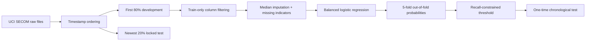
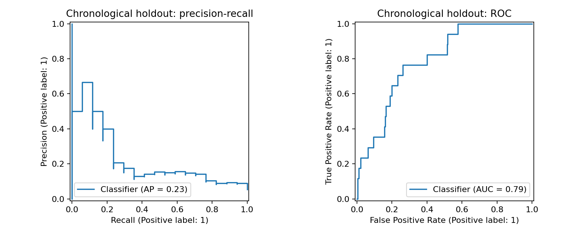

# Semiconductor Yield Excursion Prediction

[](https://github.com/emirhankaya-AFK/semiconductor-yield-prediction/actions/workflows/ci.yml)
[](pyproject.toml)

A reproducible study of rare manufacturing-failure detection using the real-world
[UCI SECOM dataset](https://archive.ics.uci.edu/dataset/179/secom). The project treats the
problem as it appears in practice: hundreds of noisy process measurements, missing values,
only 6.6% failed units, asymmetric error costs, and temporal distribution shift.

## Why this is not a toy classifier

- The newest 20% of observations is locked as a chronological holdout.
- Missingness and constant-column filters are learned without seeing the holdout.
- Model selection uses out-of-fold development predictions, not test feedback.
- The decision threshold is fixed before test evaluation and targets at least 50% development recall.
- False negatives cost 10 times false positives in the reported operating metric.
- PR-AUC and ROC-AUC include 2,000-sample bootstrap confidence intervals.



## Measured results

The chronological holdout contains 314 units and 17 failures.

| Metric | Model | Constant-prevalence baseline |
| --- | ---: | ---: |
| PR-AUC | **0.227** | 0.054 |
| ROC-AUC | **0.790** | 0.500 |
| Balanced accuracy | **0.614** | 0.500 |
| Recall | **0.353** | 0.000 |
| Weighted error cost | **147** | 170 |

The model identifies 6 of 17 failures while sending 37 false alarms. Its ROC-AUC 95% bootstrap
interval is 0.689–0.882 and PR-AUC interval is 0.098–0.461. Recall falls below the 50% development
target on the later time period, which is evidence of operating-point drift. This is a useful warning,
not hidden variance: a deployed system would need monitoring and threshold recalibration.



## Reproduce

```bash
python -m pip install -e ".[dev]"
python scripts/download_data.py
python scripts/train.py
python -m pytest -q
python -m ruff check .
```

Generated files:

- `data/manifest.json`: source URL and archive checksum
- `artifacts/metrics.json`: full split, baseline, test, and confidence-interval results
- `artifacts/test_predictions.csv`: holdout probabilities for independent analysis
- `artifacts/holdout_curves.png`: precision-recall and ROC curves
- `artifacts/model.joblib`: local trained bundle, intentionally excluded from Git

## Repository structure

```text
src/semiconductor_yield/  data, modeling, threshold and metric logic
scripts/                  download and end-to-end training entry points
tests/                    split, preprocessing, threshold and metric tests
artifacts/                versioned evaluation evidence
.github/workflows/        Python 3.11 and 3.12 quality checks
```

## Dataset and limitations

SECOM contains 1,567 examples and 590 anonymized process measurements. UCI reports 104 failed
examples and missing values in the raw measurements. The data is licensed CC BY 4.0 and cited as:

> McCann, M. & Johnston, A. (2008). SECOM [Dataset]. UCI Machine Learning Repository.
> https://doi.org/10.24432/C54305

Feature names are anonymized, so the model cannot provide equipment-level root causes. This study is
not a production quality-control system. The small number of holdout failures makes uncertainty wide,
and the selected alert threshold must be revalidated against real fab economics.

See [MODEL_CARD.md](MODEL_CARD.md) for intended use, risks, and evaluation boundaries.

## License

Code is released under the [MIT License](LICENSE). The dataset remains under its UCI CC BY 4.0 license.

